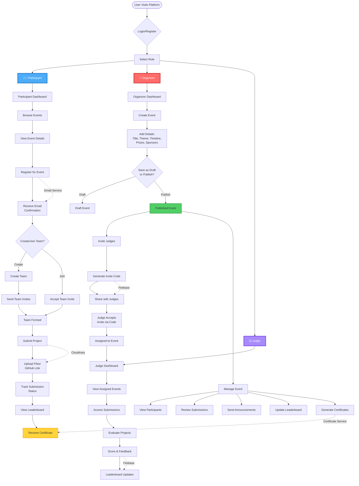

# Synaphack Platform - Process Flow Diagram

## Key Process Stages

### 🎯 Organizer Journey
1. **Event Creation** → Details Entry → Publish/Draft
2. **Judge Management** → Generate Invite Codes → Share
3. **Event Monitoring** → View Participants → Review Submissions
4. **Communication** → Announcements → Leaderboard → Certificates

### 👨‍💻 Participant Journey
1. **Discovery** → Browse Events → Register
2. **Team Formation** → Create/Join Team → Invite Members
3. **Submission** → Upload Project → Track Status
4. **Recognition** → View Leaderboard → Get Certificate

### ⚖️ Judge Journey
1. **Onboarding** → Accept Invite → Assignment
2. **Evaluation** → View Submissions → Score Projects
3. **Feedback** → Provide Comments → Update Rankings

## System Services
- **Firebase Auth** - User authentication
- **Firestore** - Data storage
- **Email Service** - Notifications
- **Cloudinary** - File uploads
- **Certificate Service** - Auto-generation
- **Git MCP** - AI code analysis
