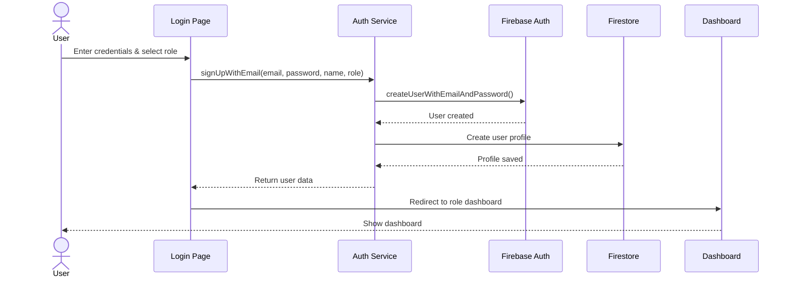
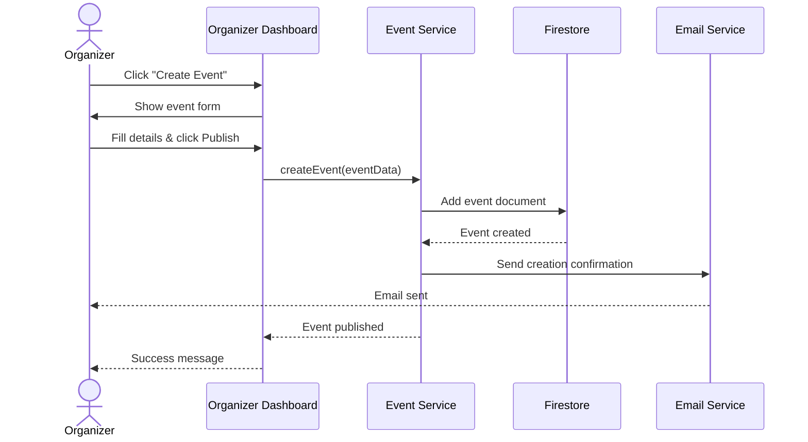
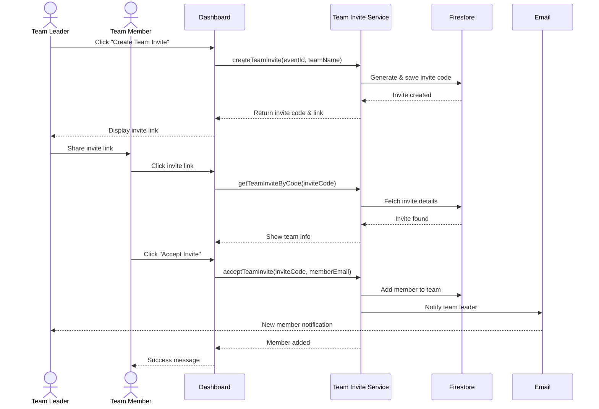
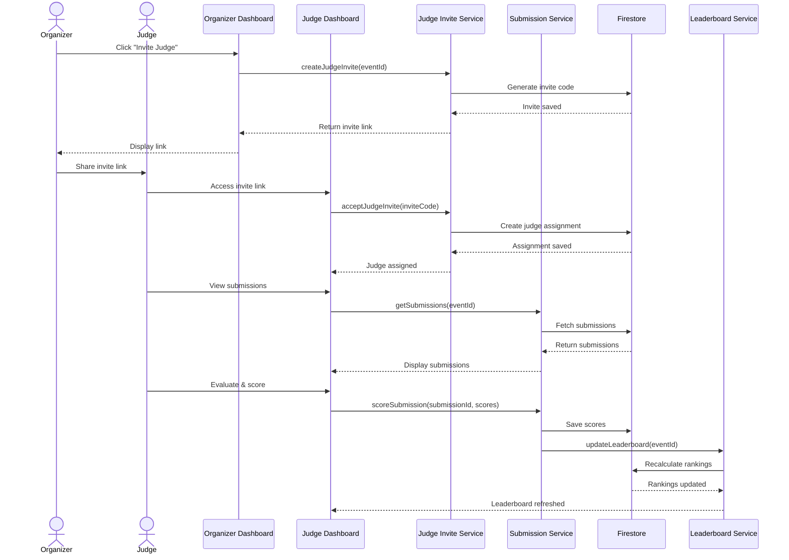

# Synaphack Platform - Sequence Diagrams

## 1. User Registration & Login Sequence



## 2. Event Creation & Publishing Sequence



## 3. Participant Registration Sequence

```mermaid
sequenceDiagram
    actor Participant
    participant Browse as Event Browser
    participant RegModal as Registration Modal
    participant EventSvc as Event Service
    participant DB as Firestore
    participant Email as Email Service
    
    Participant->>Browse: Browse events
    Browse->>Participant: Show event list
    Participant->>Browse: Select event
    Browse->>RegModal: Open registration modal
    Participant->>RegModal: Fill registration form
    RegModal->>EventSvc: registerForEvent(eventId, userEmail, teamName)
    EventSvc->>DB: Create registration document
    DB-->>EventSvc: Registration saved
    EventSvc->>DB: Update participant count
    EventSvc->>Email: Send confirmation email
    Email-->>Participant: Confirmation received
    EventSvc-->>RegModal: Registration complete
    RegModal-->>Participant: Success message
```

## 4. Team Formation Sequence



## 5. Project Submission Sequence

```mermaid
sequenceDiagram
    actor Participant
    participant SubmitForm as Submission Form
    participant SubSvc as Submission Service
    participant CloudSvc as Cloudinary Service
    participant DB as Firestore
    participant GitMCP as Git MCP Service
    participant AI as Gemini AI
    
    Participant->>SubmitForm: Fill submission details
    Participant->>SubmitForm: Upload files
    SubmitForm->>CloudSvc: Upload files
    CloudSvc-->>SubmitForm: Return file URLs
    SubmitForm->>SubSvc: submitProject(data)
    SubSvc->>DB: Create submission document
    DB-->>SubSvc: Submission saved
    
    alt GitHub link provided
        SubSvc->>GitMCP: analyzeCode(githubUrl)
        GitMCP->>AI: Request code analysis
        AI-->>GitMCP: Analysis results
        GitMCP->>DB: Store analysis results
    end
    
    SubSvc-->>SubmitForm: Submission complete
    SubmitForm-->>Participant: Success message
```

## 6. Judge Invitation & Evaluation Sequence



## 7. Certificate Generation Sequence

```mermaid
sequenceDiagram
    actor Organizer
    participant Dashboard
    participant CertSvc as Certificate Service
    participant DB as Firestore
    participant CloudSvc as Cloudinary
    participant Email
    actor Participant
    
    Organizer->>Dashboard: Click "Generate Certificates"
    Dashboard->>CertSvc: generateCertificates(eventId)
    CertSvc->>DB: Fetch event winners
    DB-->>CertSvc: Return winners list
    
    loop For each winner
        CertSvc->>CertSvc: Create certificate design
        CertSvc->>CloudSvc: Upload certificate PDF/Image
        CloudSvc-->>CertSvc: Return URL
        CertSvc->>DB: Save certificate record
        CertSvc->>Email: Send certificate to participant
        Email-->>Participant: Certificate received
    end
    
    CertSvc-->>Dashboard: All certificates generated
    Dashboard-->>Organizer: Success message
```

## 8. Real-time Communication Sequence

```mermaid
sequenceDiagram
    actor Organizer
    actor Participant
    participant Comm as Communication Component
    participant CommSvc as Communication Service
    participant DB as Firestore (Real-time)
    
    Organizer->>Comm: Open event communication
    Comm->>CommSvc: Subscribe to messages
    CommSvc->>DB: Add real-time listener
    
    Organizer->>Comm: Type announcement
    Comm->>CommSvc: sendMessage(eventId, message)
    CommSvc->>DB: Add message document
    DB-->>CommSvc: Message saved (trigger)
    
    Note over DB,Participant: Real-time update
    DB-->>Comm: Notify all listeners
    Comm-->>Participant: Display new message
    
    Participant->>Comm: Type question
    Comm->>CommSvc: sendMessage(eventId, question)
    CommSvc->>DB: Add question document
    DB-->>Comm: Update all participants
    Comm-->>Organizer: Show new question
```

## Key Interaction Patterns

### 🔄 Real-time Updates
- **Firestore Listeners**: Automatic UI updates when data changes
- **Leaderboard**: Live ranking updates as judges score
- **Communication**: Instant message delivery

### 🔐 Authorization Checks
- **Before Action**: Verify user role and permissions
- **Service Layer**: Validate ownership/access rights
- **Database Rules**: Firebase security rules enforce access control

### 📧 Asynchronous Notifications
- **Non-blocking**: Email sending doesn't block UI
- **Background Jobs**: Certificate generation happens async
- **Event-driven**: Triggers based on state changes

### 🎯 Error Handling
- **Try-Catch**: All service calls wrapped in error handlers
- **User Feedback**: Clear error messages displayed
- **Fallback**: Graceful degradation if services fail
