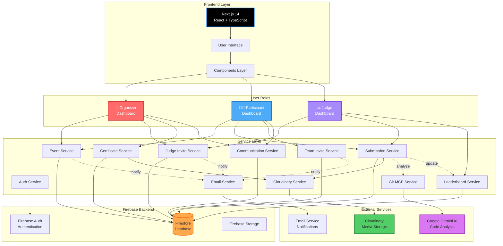

# Synaphack Platform - System Architecture Diagram



## Technology Stack

### 🎨 Frontend
- **Framework**: Next.js 14 (App Router)
- **Language**: TypeScript
- **UI Library**: React 18
- **Styling**: Tailwind CSS
- **3D Graphics**: Three.js
- **Animation**: Custom CSS animations

### 🔧 Backend Services
- **Authentication**: Firebase Auth (Email + Google OAuth)
- **Database**: Firebase Firestore (NoSQL)
- **File Storage**: Cloudinary (Images/Files) + Firebase Storage
- **Real-time**: Firestore real-time listeners

### 🤖 AI/ML Integration
- **Code Analysis**: Google Gemini AI via Git MCP
- **Use Case**: Automated code quality assessment

### 📧 Communication
- **Email Service**: Custom email service for notifications
- **In-app Messaging**: Event communication system

## Data Models

### Core Collections
```
users/
├── {userId}
│   ├── email
│   ├── name
│   ├── role (organizer|participant|judge)
│   └── createdAt

events/
├── {eventId}
│   ├── title
│   ├── description
│   ├── theme
│   ├── timeline
│   ├── prizes[]
│   ├── sponsors[]
│   ├── organizerId
│   └── status

submissions/
├── {submissionId}
│   ├── eventId
│   ├── participantEmail
│   ├── projectName
│   ├── githubLink
│   ├── files[]
│   ├── status
│   └── scores[]

registrations/
├── {registrationId}
│   ├── eventId
│   ├── participantEmail
│   ├── teamName
│   └── registeredAt

judgeAssignments/
├── {assignmentId}
│   ├── eventId
│   ├── judgeEmail
│   └── inviteCode

certificates/
├── {certificateId}
│   ├── eventId
│   ├── participantEmail
│   ├── certificateUrl
│   └── issuedAt
```

## Key Features Implementation

### 🔐 Authentication Flow
```
User → Select Role → Email/Google Auth → Firebase Auth
→ Create User Profile → Store in Firestore → Redirect to Dashboard
```

### 📝 Event Lifecycle
```
Create → Draft → Publish → Registration → Ongoing
→ Submission → Evaluation → Completed → Certificates
```

### 🏆 Scoring System
```
Judge Evaluates → Submit Scores → Aggregate Scores
→ Calculate Ranking → Update Leaderboard → Real-time Update
```

### 📨 Notification System
```
Trigger Event → Email Service → Generate Email
→ Send via SMTP → Log Notification → User Receives
```

## Security Features
- ✅ Firebase Authentication
- ✅ Role-based Access Control (RBAC)
- ✅ Invite Code Validation
- ✅ Secure File Upload (Cloudinary)
- ✅ Environment Variables for Secrets
- ✅ Client-side Authorization Checks

## Performance Optimizations
- ⚡ Next.js Server-Side Rendering (SSR)
- ⚡ Code Splitting
- ⚡ Image Optimization (Cloudinary)
- ⚡ Firestore Query Optimization
- ⚡ Real-time Updates (Efficient Listeners)

## Deployment Architecture
```
GitHub → Vercel (Frontend) → Firebase (Backend)
                           → Cloudinary (Media)
                           → Email Service
```
