# Synaphack Platform - Use Case Diagram

```mermaid
graph TB
    %% Actors
    Organizer([🎯 Organizer])
    Participant([👨‍💻 Participant])
    Judge([⚖️ Judge])
    System([🤖 System])
    
    %% Use Cases - Organizer
    Organizer --> UC1[Create Event]
    Organizer --> UC2[Edit Event]
    Organizer --> UC3[Delete Event]
    Organizer --> UC4[Publish Event]
    Organizer --> UC5[Invite Judges]
    Organizer --> UC6[View Registrations]
    Organizer --> UC7[Review Submissions]
    Organizer --> UC8[Send Announcements]
    Organizer --> UC9[Manage Leaderboard]
    Organizer --> UC10[Generate Certificates]
    Organizer --> UC11[Manage Sponsors]
    Organizer --> UC12[Set Prizes]
    
    %% Use Cases - Participant
    Participant --> UC20[Register/Login]
    Participant --> UC21[Browse Events]
    Participant --> UC22[Register for Event]
    Participant --> UC23[Create Team]
    Participant --> UC24[Send Team Invite]
    Participant --> UC25[Accept Team Invite]
    Participant --> UC26[Submit Project]
    Participant --> UC27[Upload Files]
    Participant --> UC28[Track Submission]
    Participant --> UC29[View Leaderboard]
    Participant --> UC30[Download Certificate]
    Participant --> UC31[Ask Questions]
    Participant --> UC32[View Event Details]
    
    %% Use Cases - Judge
    Judge --> UC40[Accept Judge Invite]
    Judge --> UC41[View Assigned Events]
    Judge --> UC42[Access Submissions]
    Judge --> UC43[Evaluate Projects]
    Judge --> UC44[Provide Scores]
    Judge --> UC45[Give Feedback]
    Judge --> UC46[View Leaderboard]
    Judge --> UC47[Join Communication]
    
    %% System Use Cases
    System --> UC60[Send Email Notifications]
    System --> UC61[Validate Invite Codes]
    System --> UC62[Track Deadlines]
    System --> UC63[Auto-generate Certificates]
    System --> UC64[Store Files Cloudinary]
    System --> UC65[Git MCP Integration]
    System --> UC66[Update Leaderboard]
    System --> UC67[Firebase Authentication]
    
    %% Relationships and Extensions
    UC1 -.->|includes| UC11
    UC1 -.->|includes| UC12
    UC4 -.->|triggers| UC60
    UC22 -.->|triggers| UC60
    UC26 -.->|uses| UC64
    UC43 -.->|updates| UC66
    UC10 -.->|uses| UC63
    UC5 -.->|generates| UC61
    UC40 -.->|validates| UC61
    UC26 -.->|optional| UC65
    
    %% Styling
    classDef organizerClass fill:#ff6b6b,stroke:#c92a2a,stroke-width:2px,color:#fff
    classDef participantClass fill:#4dabf7,stroke:#1971c2,stroke-width:2px,color:#fff
    classDef judgeClass fill:#a78bfa,stroke:#7c3aed,stroke-width:2px,color:#fff
    classDef systemClass fill:#51cf66,stroke:#2b8a3e,stroke-width:2px,color:#fff
    classDef usecaseClass fill:#fff9db,stroke:#f59f00,stroke-width:1px
    
    class Organizer organizerClass
    class Participant participantClass
    class Judge judgeClass
    class System systemClass
    class UC1,UC2,UC3,UC4,UC5,UC6,UC7,UC8,UC9,UC10,UC11,UC12 usecaseClass
    class UC20,UC21,UC22,UC23,UC24,UC25,UC26,UC27,UC28,UC29,UC30,UC31,UC32 usecaseClass
    class UC40,UC41,UC42,UC43,UC44,UC45,UC46,UC47 usecaseClass
    class UC60,UC61,UC62,UC63,UC64,UC65,UC66,UC67 usecaseClass
```



## Detailed Use Case Descriptions

### 🎯 ORGANIZER Use Cases

| Use Case | Description | Precondition | Postcondition |
|----------|-------------|--------------|---------------|
| **Create Event** | Organizer creates new hackathon event | User logged in as organizer | Event saved in database |
| **Publish Event** | Make event visible to participants | Event created | Event appears in public listing |
| **Invite Judges** | Generate and share judge invite codes | Event published | Judges can accept invitation |
| **Review Submissions** | View and evaluate participant projects | Submissions received | Organizer can assess quality |
| **Generate Certificates** | Create certificates for winners | Event completed | Participants can download certificates |

### 👨‍💻 PARTICIPANT Use Cases

| Use Case | Description | Precondition | Postcondition |
|----------|-------------|--------------|---------------|
| **Register for Event** | Sign up for a hackathon | User logged in | Registration recorded |
| **Create Team** | Form a team for participation | Registered for event | Team created |
| **Submit Project** | Upload project submission | Team formed | Submission recorded |
| **Track Submission** | Monitor submission status | Project submitted | Status visible (pending/approved/rejected) |
| **Download Certificate** | Get completion certificate | Event completed | Certificate downloaded |

### ⚖️ JUDGE Use Cases

| Use Case | Description | Precondition | Postcondition |
|----------|-------------|--------------|---------------|
| **Accept Judge Invite** | Join event as judge via invite code | Invite code received | Judge assigned to event |
| **Evaluate Projects** | Review and score submissions | Access granted | Evaluation recorded |
| **Provide Feedback** | Give constructive feedback | Evaluation done | Feedback visible to participants |
| **View Leaderboard** | Check current rankings | Scores submitted | Rankings displayed |

### 🤖 SYSTEM Use Cases

| Use Case | Description | Trigger | Result |
|----------|-------------|---------|--------|
| **Send Email Notifications** | Automated emails for key events | Registration, submission, results | Users notified |
| **Validate Invite Codes** | Verify invite code authenticity | Judge/team invite acceptance | Access granted/denied |
| **Auto-generate Certificates** | Create certificates based on results | Event completion | PDFs generated |
| **Git MCP Integration** | AI-powered code analysis | Project submission (optional) | Code quality insights |
| **Update Leaderboard** | Real-time ranking updates | Judge scoring | Rankings refreshed |

## Use Case Relationships

- **<<includes>>** - One use case includes another
  - Create Event includes Manage Sponsors, Set Prizes
  
- **<<extends>>** - Optional or conditional use case
  - Submit Project extends Git MCP Integration
  
- **<<triggers>>** - One use case triggers another
  - Register for Event triggers Send Email Notifications
  - Evaluate Projects triggers Update Leaderboard

## Actor Interactions

```
Organizer ←→ System ←→ Participant
              ↕
            Judge
```

All actors interact through the system, with automated services handling notifications, validations, and updates.
